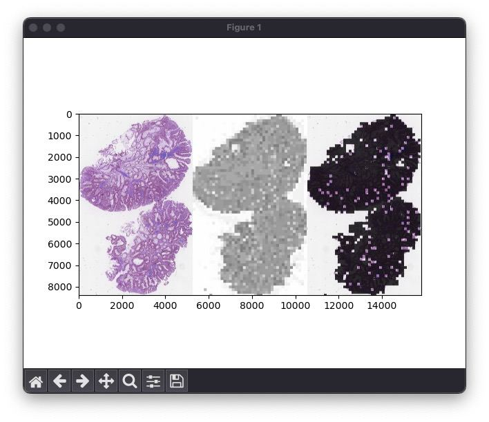
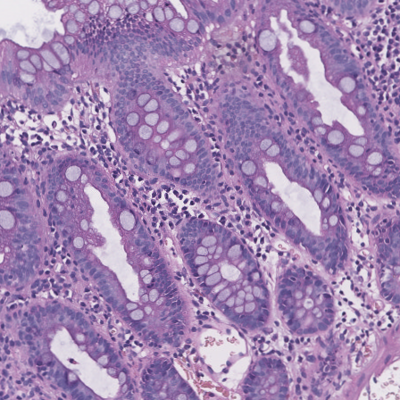
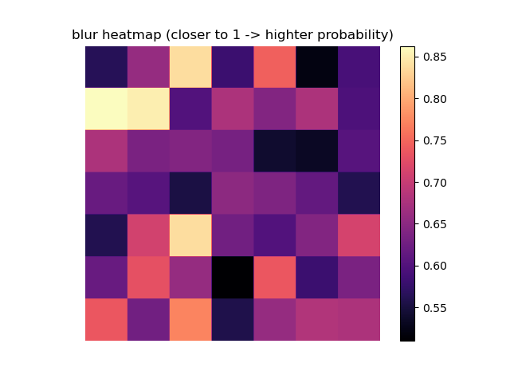
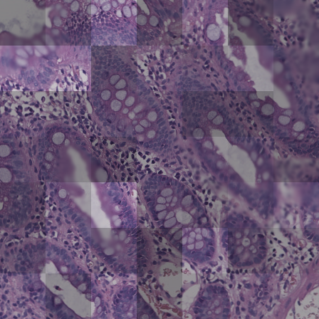

# Blur Artifacts Detection 
Detection of Blur Artifacts in Histopathological Whole-Slide Images of Endomyocardial Biopsies

## Examples

### full-size image
<!--  -->
<p align="center" width="100%">
    
</p>

### zoomed patch

<p align="center" width="100%">
    
</p>

<p align="center" width="100%">
    
</p>

<p align="center" width="100%">
    
</p>


## install dependencies
```
python -m pip install -r requirements.txt
```

## faster-rcnn
```
cd faster_rcnn
git clone 'https://github.com/facebookresearch/detectron2
python -m pip install -e detectron2
python inference.py --path2image filename.png --path2save another_filename.png --threshold 0.5
```

## YOLOv7
```
cd yolo
git clone https://github.com/WongKinYiu/yolov7.git
python -m pip install -r yolov7/requirements.txt
python yolov7/detect.py --weights best.pt --conf 0.001 --img-size 1280 --iou-thres 0.25 --source image.png
```

## catboost
```
cd catboost
python inference.py --path2image filename.png --path2save another_filename.png
```

